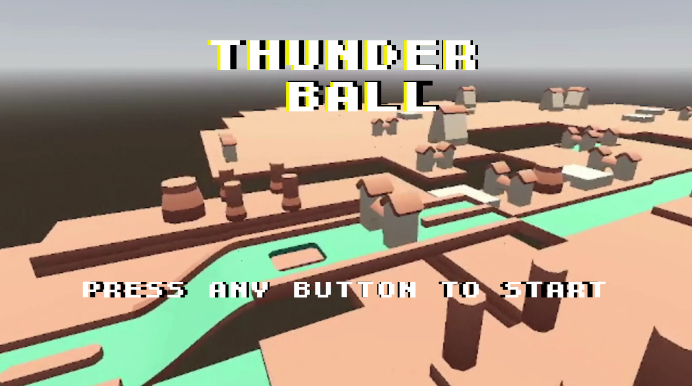
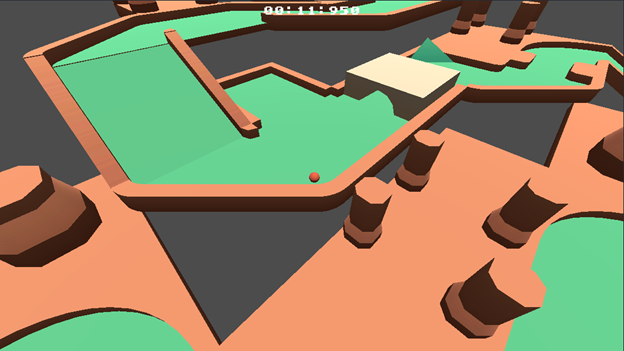
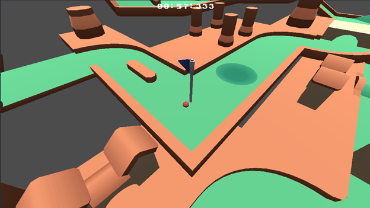
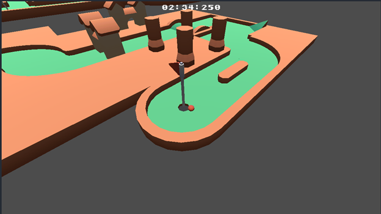
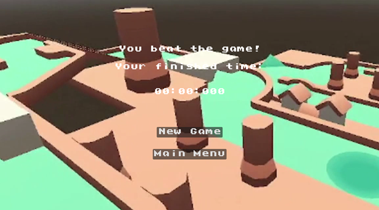

# Thunder Ball
**Project Group 2**

# โครงงานเกม 3D
**CP352203 - Computer Game Development**

# ผู้จัดทำ
- 673380025-8 นายกรกฏ พรมทอง CP-CS (วิทยาลัยการคอมพิวเตอร์)
- 673380059-1 นายวัชรวิศว์ น้อยเมล์ CP-CS (วิทยาลัยการคอมพิวเตอร์)
- 673380263-2 นายจิณณวัตร โพธิ์ศรีทอง CP-CS (วิทยาลัยการคอมพิวเตอร์)
- 673380295-9 นายสรวิชญ์ ทะมานันท์ CP-CS (วิทยาลัยการคอมพิวเตอร์)

# ชื่อเกม
**Thunder Ball (บอลสายฟ้า)**

# Theme
**Platformer ,3D**

# Story
เราได้รับบทเป็นลูกบอล ที่ต้องหาทางออกจากสถานที่แห่งนี้ โดยการที่เราจะสามารถออกจากสภานที่แห่งนี้ได้เราต้องตามหาธงสีแดงและต้องกลิ้งไปให้ถึงให้ได้
# Character
**Red Ball (Player)**

# รูปแบบการเล่น และ กติกา
- **การควบคุมตัวละคร**
- W: กลิ้งไปข้างหน้า
- S: กลิ้งไปข้างหลัง
- A : กลิ้งไปทางซ้าย
- D : กลิ้งไปทางขวา
- **รูปแบบการเล่น**
- เกม 3D Arcade / Racing:เป็นเกมแนวแข่งกับความเร็ว ผู้เล่นต้องคอยหลบสิ่งกีดขวาง และไปให้ถึงจุดหมายให้เร็วที่สุดเพื่อทำเวลาให้ดีที่สุดจำกัดการมองเห็นของผู้เล่น
- กับดักและสิ่งกีดขวาง:ในด่านจะมีกับดักและสิ่งกีดขวางคอยขัดขวางผู้เล่น เช่นจะมีหลุมที่ทำให้ผู้เล่นตกลงไป
ภารกิจในด่าน:ผู้เล่นต้องกลิ้งไปลงในหลุมที่มีธงสีแดงใหได้
- ระบบ check point: ผู้เล่นสามารถกำหนดจุดเกิดใหม่ โดยการกลิ้งไปโดนธงสีน้ำเงิน
**กติกา**
ผู้เล่นต้องระวังสิ่งกีดขวาง เช่น กับดัก 
ผู้เล่นกลิ้งไปให้ถึงธงสีแดงให้ได้
เมื่อผู้เล่นสามารถไปถึงธงสีแดง ด่านที่ 2 ได้จะถือว่าชนะ จะถือว่าชนะ

# แนวคิดการออกแบบ
- **งานภาพ**
- ออกแบบฉากให้เป็นธีมสนามกอร์ฟ
- งานภาพเป็น 3D 
- สีภาพเน้นสีเขียวและน้ำตาล  สีเขียวสื่อถึงสนามกอร์ฟ และสีน้ำตาลจะเป็นสิ่งกีดขวาง
- **เสียง**
- เพลงประกอบ: เป็นเสียงเพลงที่ทำให้รู้สึกสนุก ตื่นเต้น
- เสียงประกอบ: เสียงเมื่อแตะธง check point และเสียงเมื่อแตะธงสีแดง
แรงบันดาลใจ
- มาจากเกม Hamsterball
- **แรงบันดาลใจ**
- มาจากเกม Hamster Ball

# กลุ่มเป้าหมาย (ผู้เล่น)
- เด็กที่ชอบเล่นเกมแนว Hamster ball 
- คนที่ชแบเล่นเกมหลบเลี่ยงสิ่งกีดขวาง

# AGE Analysis
- **อารมณ์ของเกม:**
- ความเศร้า-เสียใจ จากการตายในเกม
- ความโกรธ การตกหลุม แต่ไม่ได้ไปแตะจุด check point ทำให้ต้องเริ่มตั้งแต่ต้น
- ความตื่นเต้น การต้องคอยหลบเลี่ยงหลุมและควบคุมความแรงของบอลให้ได้
- ความกลัว การตกหลุม
- ความภูมิใจ การสามารถผ่านด่านทั้งหมดโดยไม่ตกหลุมและสามารถผ่านได้ด้วยเวลาที่รวดเร็ว
- ความสุข  ชนะเกมได้โดยไม่ต้องใช้ check point
- **สิ่งที่ใช้กระตุ้นสัญชาติญาณ**
- การเอาชีวิตรอด
- -
- อยากสวมบทบาท (เป็นตัวละครในเกม)
สวมบทบาทเป็นลูกบอล
- สะสมสิ่งของ
- -
- ความโลภ
- -
- การปกป้อง
- -
- การสื่อสาร
- -
- ชอบสีสัน
ออกแบบสีให้เป็นสีเขียวขสีน้ำตาล
- สำรวจ
มีด่านที่หลากหลาย 
- ก้าวร้าว
- -
- ความแค้น
- -
- แข่งขัน
การต้องผ่านด่านให้เร็วที่สุดเพื่อทำเวลาให้ดีที่สุด

# ประโยชน์ของเกม
- ความท้าทาย ฝึกความอดทด ฝึกทักษะ

# หน้าจอ Demo ฉากในเกม
- หน้าเมนู

- หน้าเล่นเกม
 

- คำอธิบาย: ผู้เล่นต้องคอยหลบสิ่งกีดขวางและกับดัก เพื่อไปให้ถึงเส้นชัย

 
- คำอธิบาย :เมื่อผู้เล่นแตะธงสีน้ำเงิน จะถือว่ากำหนด check point ใหม่แล้ว
 

- คำอธิบาย : เมื่อผู้เล่นแตะธงสีแดงจะถือว่าชนะหน้า ชนะ
 

- VDO  (Link ไป clip vdo)
- https://drive.google.com/file/d/1wtPNrkPYFbdI7xgY3O5rWCsbI_CVsFmT/view?usp=sharing

- อ้างอิงระบุแหล่งที่มาของ Source Code และ Asset ต่าง ๆ ที่ใช้
- Template และ Assets นำมาจาก
https://kenney.nl/assets/minigolf-kit
- เพลงประกอบ นำมาจาก
https://pixabay.com/th/sound-effects/search/game-music
- Font นำมาจาก
https://eggboycolor.itch.io/omelette-font-set

